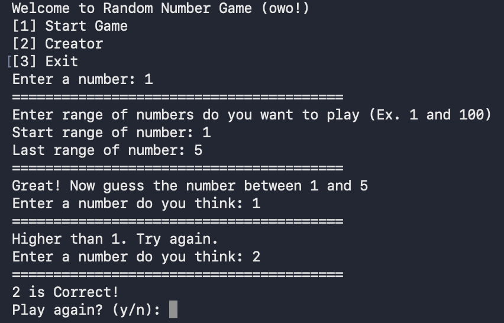

# Random Number Game

A simple number guessing game made with Python.
Try to guess the number between a range you choose!



## Installation

1. Clone the repo:
```bash
git clone https://github.com/Merunthicha/random-number-game.git
```

2. Run the game
```bash
python main.py
```

---

## How to Play

1. Choose the range of numbers.
2. Guess the number until you find the correct one.
3. Follow hints: Higher / Lower
4. Have fun!


---

## Creator

- Name: Merunthicha G. Chanpirom Wong
- GitHub: [@Merunthicha](https://github.com/Merunthicha)  
- Telegram: [@Merunthicha](https://t.me/Merunthicha)
- YouTube: [@Merunthicha](https://www.youtube.com/@Merunthicha)

## Version

```bash
Version 1.0
-
Version 1.1
- Debug
Version 1.2
- No Debug
Version 1.3
- WTF AGAIN
 ```