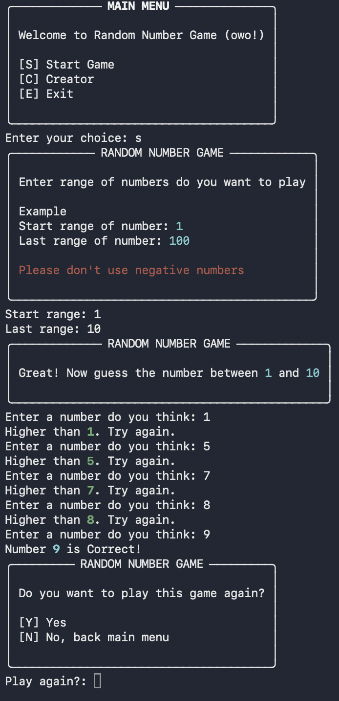

# Random Number Game

A simple number guessing game made with Python.
Try to guess the number between a range you choose!

## Installation

1. Clone the repo:
```bash
git clone https://github.com/Merunthicha/Random_number_game.git
```

2. Run the game
```bash
python main_(Version).py
```
ex. python main_v1.0.py

## Installation

```bash
pip install -r requirements_(Version).txt
```
ex. pip install -r requirements_v1.1.txt

---

## How to Play

1. Choose the range of numbers.
2. Guess the number until you find the correct one.
3. Follow hints: Higher / Lower
4. Have fun!


---

## Creator

- Name: Merunthicha (Wanvisa Phumam)
- GitHub: [@Merunthicha](https://github.com/Merunthicha)  
- Telegram: [@Merunthicha](https://t.me/Merunthicha)
- YouTube: [@Merunthicha](https://www.youtube.com/@Merunthicha)

---

## [Version 1.0] - 2026-04-07

### Added
```
- Initial release of Random Number Game.
- Core gameplay mechanics and basic range settings.
```
---

# Updates

 ## [Version 1.1] - 2026-04-08
 
### Added
```
- Implemented the **Rich** library to enhance Terminal UI and visual appeal.
```

### Fixed
```
- Fixed recursion bugs in the game loop.
- Improved input validation for the Play Again menu.
- Fixed an issue where the main menu would not reappear after finishing a game.
```

---

